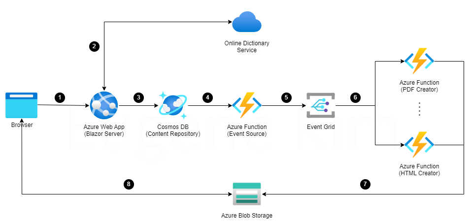

# Azure Enlish Dictionary
This project utilizes the Azure resources to collect and manipulate the content of online English dictionary to provide the users by using the web app.

## System Diagram

| Flow | Description |
|:-:|-|
|1|User visits the web site to add a new word.|
|2|Web app consumes the online English dictionary service to retrieve the word content. |
|3|Web app adds the word content to Cosmos DB as a new item.|
|4|Cosmos DB triggers the Azure function to notify the update.|
|5|Azure Function sends an event to Azure Event Grid.|
|6|Azure Event Grid forwards the event to the Azure Functions.|
|7|Azure Functions generate the document (PDF, HTML and etc) for the word and upload them to the Blob storage.|
|8|User downloads the document from the Blob storage.|

## How to deploy infrastructure
The project source includes the PowerShell script (Setup.ps1) for the Azure infrastructure auto-deployment. 
You *must* replace the values assigned in the beginning of the script before running.

## External materials
I appreciate the owners and contributors of the following external libraries to make this project complete.
* [Free Dictionary API](https://github.com/meetDeveloper/freeDictionaryAPI): Free Dictionary API on the web.
* [iText](https://github.com/itext/itext7-dotnet): iText .NET SDK to generate a PDF document.

The library below is published by my other GitHib project.
* [EgBlazorComponents](https://github.com/EugeneKim/EgBlazorComponents): Blazor server side UI components.

## In closing
This project is intended to expand my Azure knowledge and the initial work for next personal projects.
<em>Feel free to contact me if you have any questions and interests.</em>
